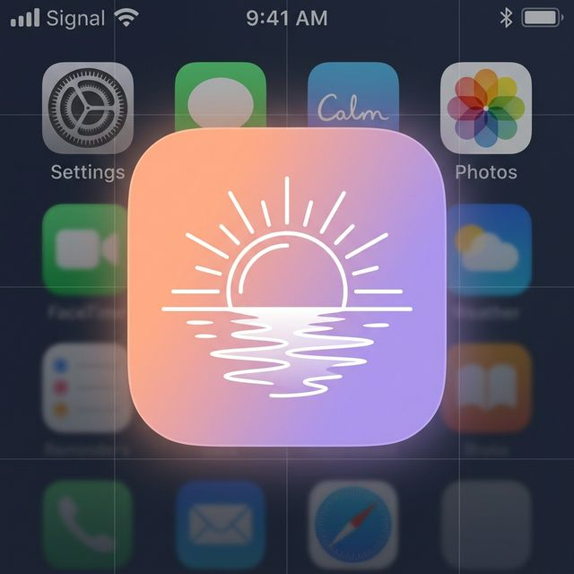

<p align="center">
  
</p>

<h1 align="center">☀️ Daily</h1>

<p align="center">
  <strong>AI-powered mental health companion with real-time multi-modal biomarker analysis</strong>
</p>

<p align="center">
  
  
  
  
</p>

---

## 🎯 What is Daily?

**Daily** is a proactive mental health iOS app prototype that uses **real-time facial emotion detection, vocal biomarker analysis, eye tracking, and AI-powered clinical analysis** to understand how you're _really_ feeling — not just what you type.

Built during the **US-Nepal Hackathon 2026**, Daily demonstrates 5 key scenarios:

| # | Scenario | Description |
|---|----------|-------------|
| 0 | 🔒 **Lock Screen Alert** | Smartwatch HRV spike triggers compassionate notification |
| 1 | 🛡️ **Proactive Support** | Calendar + HRV data drives pre-meeting interventions |
| 2 | 🎙️ **Multi-Modal Check-In** | **Real** camera + mic + AI analysis of emotions, voice, and eyes |
| 3 | 🚨 **Safety Net & Recovery** | Crisis keyword detection + emergency resources |
| 4 | 📊 **Weekly Insights** | Mood trends, HRV charts, and CBT cognitive distortion analysis |

### ✨ The "Real" Part — Scenario 2

Unlike the other demo scenarios, **Scenario 2 is fully functional**:

- 📸 **Real camera feed** — live `getUserMedia` video
- 🧠 **MediaPipe FaceLandmarker** — 52 facial blendshapes → 7 emotion scores in real-time
- 🎵 **Vocal analysis** — Web Audio API computes jitter, shimmer, pitch (F0), and energy
- 👁️ **Eye tracking** — blink rate (blinks/min) and gaze avoidance % from blendshapes
- 📝 **Live speech-to-text** — browser SpeechRecognition API
- 🤖 **Gemini AI analysis** — all biomarker data + transcript sent to backend for clinical insights

---

## 🚀 Quick Start

### Prerequisites

- **Python 3.10+**
- **Google API Key** ([Get one here](https://aistudio.google.com/app/apikey))
- **Chrome browser** (recommended for SpeechRecognition + MediaPipe GPU)

### 1. Clone & Setup Backend

```bash
git clone https://github.com/YOUR_USERNAME/Daily.git
cd Daily

# Create Python virtual environment
cd backend
python3 -m venv venv
source venv/bin/activate  # On Windows: venv\Scripts\activate

# Install dependencies
pip install -r requirements.txt

# Set your API key
cp .env.example .env
# Edit .env and add your GOOGLE_API_KEY
```

### 2. Start the Backend

```bash
cd backend
source venv/bin/activate
uvicorn main:app --port 8000 --reload
```

### 3. Serve the Frontend

In a new terminal:

```bash
cd Daily
npx -y serve . -l 3456
```

### 4. Open in Chrome

```
http://localhost:3456
```

Navigate to **Scenario 2** → grant camera/mic → record → hit **"✨ Analyze with AI"**

---

## 🏗️ Architecture

```
Daily/
├── index.html          # Single-page iOS prototype (all screens)
├── app.js              # App logic + CheckInEngine (MediaPipe, Audio, Eye, Speech)
├── styles.css          # iOS-inspired design system
├── assets/
│   └── icon.png        # App icon
└── backend/
    ├── main.py         # FastAPI app + /api/checkin/analyze endpoint
    ├── gemini_client.py    # Gemini 2.0 Flash therapeutic AI
    ├── models.py           # Pydantic data models
    ├── risk_monitor.py     # Crisis keyword detection
    ├── report_generator.py # Clinical report generation
    ├── distortion_analyzer.py  # CBT cognitive distortion detection
    ├── trigger_analyzer.py     # Emotional trigger pattern analysis
    ├── requirements.txt
    └── .env.example
```

### Multi-Modal Data Flow

```
┌─────────────┐    ┌───────────────┐    ┌─────────────────┐
│   Camera    │───▶│  MediaPipe    │───▶│  Emotion Scores  │
│  (Video)    │    │  FaceLandmark │    │  (7 emotions)    │
└─────────────┘    └───────────────┘    └────────┬────────┘
                                                  │
┌─────────────┐    ┌───────────────┐    ┌────────▼────────┐
│ Microphone  │───▶│  Web Audio    │───▶│  Vocal Metrics   │
│  (Audio)    │    │  AnalyserNode │    │  (jitter/shimmer) │
└─────────────┘    └───────────────┘    └────────┬────────┘
                                                  │
┌─────────────┐    ┌───────────────┐    ┌────────▼────────┐    ┌──────────┐
│  Blendshapes│───▶│  Oculomotor   │───▶│  Eye Metrics     │───▶│  Gemini  │
│  (from MP)  │    │  Tracker      │    │  (blink/gaze)    │    │  2.0     │
└─────────────┘    └───────────────┘    └────────┬────────┘    │  Flash   │
                                                  │             │          │
┌─────────────┐    ┌───────────────┐    ┌────────▼────────┐    │  ┌─────┐ │
│  Browser    │───▶│  Speech       │───▶│  Transcript      │───▶│  │ AI  │ │
│  Mic Input  │    │  Recognition  │    │  (live text)     │    │  │Anal.│ │
└─────────────┘    └───────────────┘    └─────────────────┘    └──┴─────┘─┘
```

---

## 🛡️ API Endpoints

| Method | Endpoint | Description |
|--------|----------|-------------|
| `POST` | `/api/checkin/analyze` | Single-call check-in analysis (transcript + biomarkers → AI analysis) |
| `POST` | `/api/sessions` | Create therapy session |
| `POST` | `/api/sessions/{id}/chat` | Send message with biomarker context |
| `POST` | `/api/sessions/{id}/end` | End session |
| `GET` | `/api/sessions/{id}/report` | Generate clinical report |
| `GET` | `/api/health` | Health check |

---

## 🔑 Environment Variables

| Variable | Description | Required |
|----------|-------------|----------|
| `GOOGLE_API_KEY` | Google AI Studio API key for Gemini 2.0 | ✅ |

---

## ⚠️ Browser Compatibility

| Feature | Chrome | Firefox | Safari | Edge |
|---------|--------|---------|--------|------|
| Camera/Mic | ✅ | ✅ | ✅ | ✅ |
| MediaPipe GPU | ✅ | ⚠️ CPU | ❌ | ✅ |
| SpeechRecognition | ✅ | ❌ | ⚠️ | ✅ |
| Full experience | ✅ | ⚠️ Partial | ⚠️ Partial | ✅ |

**Chrome is strongly recommended** for the full multi-modal experience.

---

## 🏆 Built for US-Nepal Hackathon 2026

**Team**: Binit KC

**Key Technologies**:
- Google Gemini 2.0 Flash — AI therapeutic analysis
- MediaPipe FaceLandmarker — real-time facial emotion detection
- Web Audio API — vocal biomarker extraction
- FastAPI — async Python backend
- Vanilla JS — zero-dependency frontend

---

## 📄 License

MIT License — feel free to build on this!
